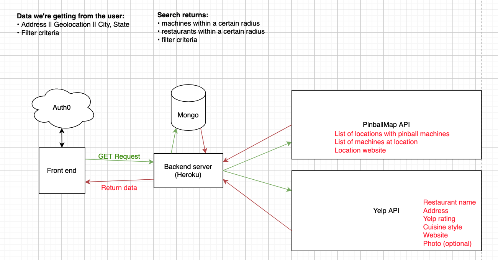
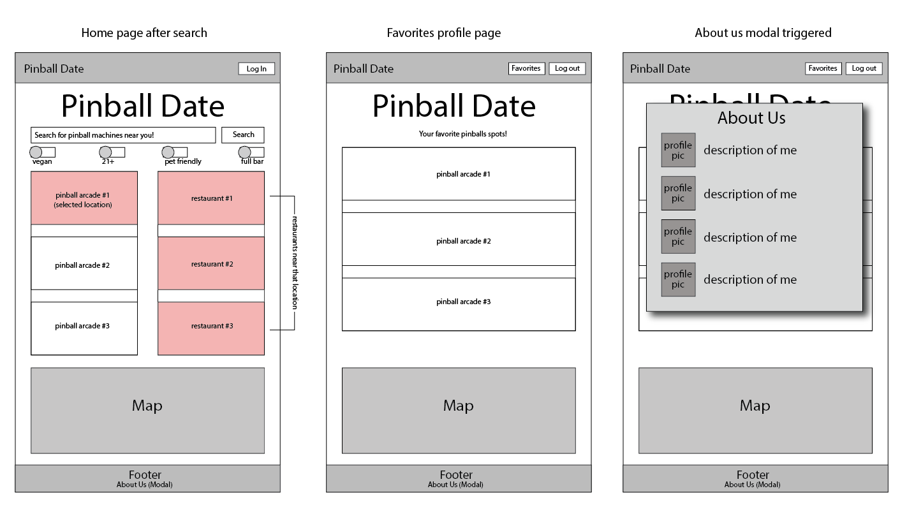
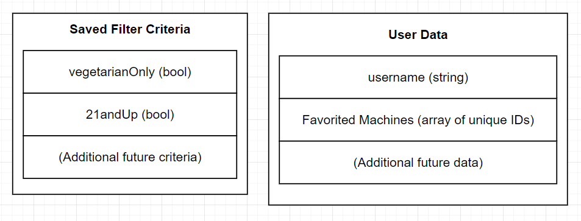

# Project Name

**Authors**: Rey Mercado, Andres Mercado, Lauren Murphy, Dan Brian
**Version**: 1.0.0

## Overview
Pinball Date provides users with the ability to locate pinball machines near their location and restaurants around the selected pinball establishments. You can make a date of it! Users can also save their favorite pinball establishments to their account using an Auth0 login.

## Getting Started
To begin using Pinball Date, [visit the website](https://pinballdate.netlify.app) and type an address into the search bar.

To deploy this application on your own sever, clone this repo onto your server, install the app's dependencies using `npm i`, then run it using `npm start`.

## Architecture
Pinball Date was built in React and NodeJS, and was deployed using Heroku and Netlify. The app uses the [Pinball Map](https://pinballmap.com/api/v1/docs) and [Yelp!](https://www.yelp.com/developers) APIs to source its information.

### Domain Model

### Wireframe

### Database Schema

